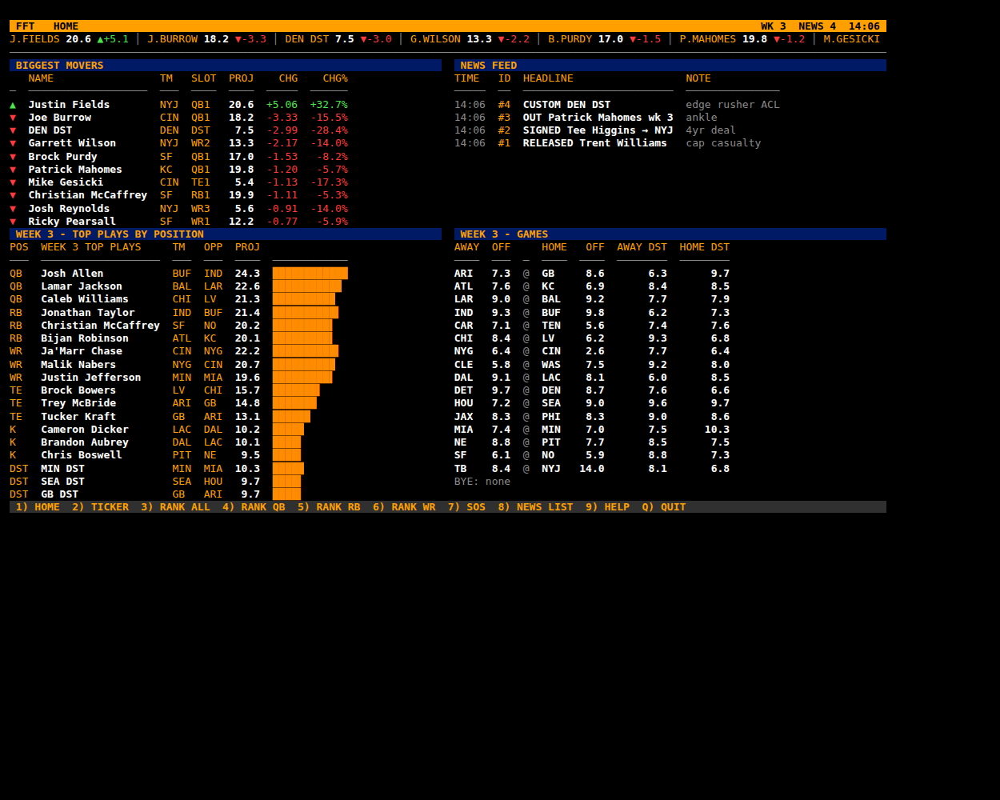
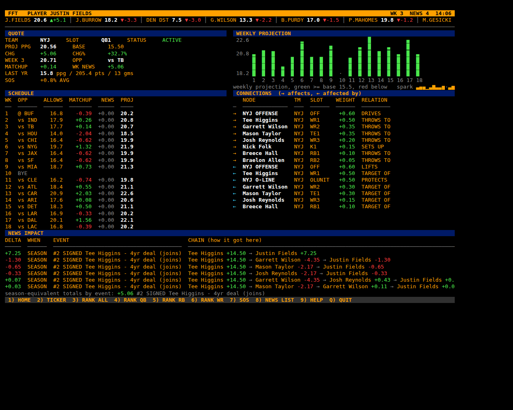
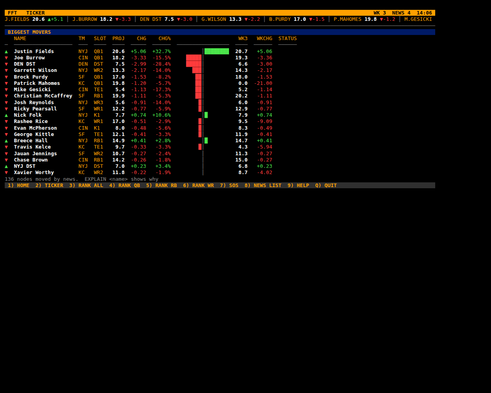
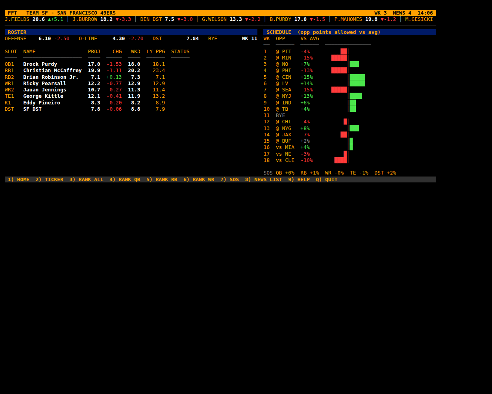

# Fantasy Football Impact Terminal

A finance-terminal style tool for fantasy football, written in plain Python
(no third-party packages).  Every player, offensive line, team offense and
defense is a node in a **weighted impact graph**.  When you add news
(injury, release, signing, trade, hype, weather ...) a shock hits one node and
ripples along the connections, so **everything connected moves, by an amount
that shrinks the further away it is**:

```
Trent Williams RELEASED (-9.0)
  → SF O-LINE   -2.70        (OL1_TO_OLUNIT 0.30)
    → Brock Purdy   -1.35    (OLUNIT_TO_QB1 0.50)
      → Ricky Pearsall -0.68 (QB1_TO_WR1 0.50)
      → SF OFFENSE   -0.81   (QB1_TO_OFF 0.60)
        → PIT DST +0.06 in week 1   (OFF_TO_OPP_DST -0.04, week-tagged edge)
```

Everything is commented so you can change it.  Start with
`fantasy_terminal/config.py` - that is where every weight lives.

## The look

Black screen, amber labels, white values, green up / red down, a status bar
and ticker strip on top of every screen, a numbered function menu at the
bottom, and dense side-by-side panels - the finance-terminal style.

**HOME** - movers, news feed, top plays this week, this week's games:



**PLAYER** - quote block, weekly projection chart, schedule, connections, and
every news chain that reached the player:



**TICKER** - biggest movers with diverging bars:



**TEAM** - roster board and schedule difficulty:



Style knobs (all in `fantasy_terminal/ui.py` → `THEME` and `config.py` → `DISPLAY`):

| Setting | What it does |
|---|---|
| `THEME["amber"]`, `["green"]`, `["red"]`, `["navy"]` ... | 256-colour codes for each role |
| `DISPLAY["WIDTH"]` | `"auto"` follows the window (min 100) or a fixed number; env `FFT_WIDTH=140` overrides |
| `DISPLAY["CLEAR_SCREEN"]` | each command replaces the screen (True) or scrolls like a log (False) |
| `DISPLAY["TICKER_CELLS"]` | how many names the top ticker strip shows |
| `--no-color` / `NO_COLOR=1` | plain text |

`python3 tools/screenshot.py out.html --quiet --script examples/demo.txt`
renders any screen to HTML (and PNG when Chromium is installed) - that is how
the images above were made.

---

## 1. Run it

```bash
python3 -m fantasy_terminal                       # interactive terminal  (or: python3 run.py)
python3 -m fantasy_terminal TICKER                # run one command, print, exit
python3 -m fantasy_terminal --script examples/demo.txt   # run a file of commands
python3 -m fantasy_terminal --no-color TEAM KC    # plain text (also: NO_COLOR=1)
python3 -m unittest discover -s tests -v          # run the tests
```

Python 3.8+ and nothing else. The optional AI headline reader needs
`pip install anthropic`; everything else, live injury data included, runs on
the standard library.

---

## 2. Commands  (type `HELP` inside the terminal)

| Command | What it does |
|---|---|
| `HOME` (`H`) | Dashboard: biggest movers, news feed, top plays by position, this week's games. Shown at startup. |
| `TICKER [POS] [--week N]` | Biggest movers board: season projection, change, %, this week's projection. |
| `RANK <POS\|ALL> [--week N]` | Rankings by projected points (QB RB WR TE K DST), with last year PPG and SOS. |
| `PLAYER <name>` (`P`) | Quote screen: projection, base, change, this week's matchup, last season, full schedule with weekly projections, connections, and every news chain that touched him. Works on team nodes too: `PLAYER KC OFF`, `PLAYER KC DST`, `PLAYER KC OL`. |
| `TEAM <ABBR>` (`T`) | Roster board, offense rating, O-line grade, DST, schedule and SOS per position. |
| `SCHED <ABBR>` | Week by week opponents with points allowed to each position (green soft, red tough). |
| `SOS [POS]` | Strength of schedule for every team for one position. |
| `WEEK [N]` | Show / set the current week used by TICKER, TEAM and PLAYER. |
| `EDGES <name>` | Every connection into and out of a node, with weights. |
| `EXPLAIN <name>` (`X`) | Why a node moved: every chain from every news item, with the delta at each hop. |
| `IMPACT <name> <delta> [--week N]` (`SIM`) | **What-if.** Preview the ripples of a shock without applying it. |
| `NEWS ADD <name> <TYPE> [magnitude \| TEAM] [--weeks N] [--depth N] [--value X] [--note "..."]` | Add news (see types below). Prints everything that moved. |
| `NEWS LIST` / `NEWS UNDO` / `NEWS DEL <id>` / `NEWS CLEAR` | Manage the news log. Undo rebuilds the graph and replays the rest. |
| `ADD "<name>" <TEAM> <POS> <proj> [--depth N]` | Create a brand new player node (rookie, free agent). |
| `LINK "<src>" "<dst>" <weight> [--label ..] [--week N]` | Add your own connection between any two nodes. |
| `UNLINK "<src>" "<dst>"` | Remove a connection. |
| `WEIGHTS [filter]` | Show every weight key and value. |
| `SET WEIGHT <KEY> <value>` | Change a weight live (graph rebuilt, news replayed). |
| `SET MAX_DEPTH 6` / `SET MIN_DELTA 0.01` / `SET DAMPING 0.9` | Tune how far shocks travel. |
| `SAVE [file]` / `LOAD [file]` | Persist the news log + weight changes as JSON (default `data/session.json`). |
| `RESET` | Back to the base projections. |
| `FEED FETCH [--ai]` | Pull real NFL news into a review queue. Without `--ai` it reads the live injury report (free, no key). With `--ai` it also reads RSS headlines using Claude. |
| `FEED LIST` / `APPLY <id\|ALL\|HIGH>` / `DROP <id>` / `SKIPPED` / `CLEAR` | Review the queue, then commit what you approve. Nothing is applied until you say so. |
| `QUIT` | Leave. |

Typing a bare menu number (`1`-`9`) jumps to that screen.  Names are fuzzy and case-insensitive: `PLAYER mahomes`, `NEWS ADD purdy OUT`.
Quote a name only when a command takes several names (`LINK "A" "B" 0.3`).

### News types  (`HELP NEWS`)

| Type | Effect |
|---|---|
| `OUT` / `INJURY` | Player's value goes to 0 for the season, or for `--weeks 3` / `--weeks 1-4`. Backups rise through the negative "shares touches" edges. |
| `QUESTIONABLE` / `DOUBTFUL` | Removes 25% / 75% of his value (season or weeks). |
| `RETURNS` | Value restored to base. |
| `SUSPENDED` | Same as OUT, meant for `--weeks 1-4`. |
| `RELEASED` / `CUT` | Leaves the team. His value drains out of the team's graph, the depth chart shifts up. |
| `SIGNED <TEAM>` / `TRADED <TEAM>` | Joins a team at `--depth N` (default 1). Old team loses his value, new team gains it, everyone below him slides down. `--value 14` sets his new projection. |
| `ROLE --depth N [magnitude]` | Depth chart change on the same team (promoted to starter). |
| `HYPE [n]` / `BUST [n]` | +n / -n points (default 2). |
| `CUSTOM n` | Raw signed shock on ANY node, including `KC OFF`, `KC OL`, `KC DST`. |
| `WEATHER n --weeks W` | Team offense hub loses n points in that week. |
| `COACH n` | Team offense hub +/- n for the season (scheme / coordinator change). |

Examples:

```
NEWS ADD trent williams RELEASED --note "cap casualty"
NEWS ADD tee higgins SIGNED NYJ --depth 1 --value 15
NEWS ADD mahomes OUT --weeks 3
NEWS ADD "BUF OFF" WEATHER 4 --weeks 12
NEWS ADD "DEN DST" CUSTOM -3 --note "star pass rusher torn ACL"
NEWS ADD bijan robinson HYPE 2.5
```

---

## 3. Pulling in real NFL news

`FEED FETCH` pulls live news and turns it into proposed `NEWS ADD` commands.
Nothing reaches the board until you approve it.

```
FFT> FEED FETCH                 live injury report (free, no API key)
SLEEPER  138 injury designations  →  35 proposals, 103 skipped

FFT> FEED LIST
ID   CONF  VIA   PLAYER              TM   TYPE          HEADLINE
#3   0.95  RULE  TreVeyon Henderson  NE   OUT           listed Out - Ankle
#8   0.85  RULE  Patrick Mahomes     KC   QUESTIONABLE  listed Questionable - Knee
...
FFT> FEED APPLY 3               commit one
FFT> FEED APPLY HIGH            commit everything at confidence >= 0.8
FFT> FEED SKIPPED               see what it refused to map, and why
```

### The two paths, and why there are two

| Path | Source | Needs | Handles |
|---|---|---|---|
| **Rule-based** (default) | [Sleeper API](https://api.sleeper.app/v1/players/nfl) | nothing - free, no key, no signup | Every injury designation in the league: Questionable, Doubtful, Out, IR, PUP, suspensions |
| **AI** (`--ai`) | ESPN / Rotowire / CBS / Yahoo / PFT RSS | `pip install anthropic` + an API key | Free-text headlines: trades, releases, depth chart changes, role news |

**Start with the rule-based path.** Sleeper publishes injury status as
structured data (`"injury_status": "Questionable"`), so a lookup table is all
it takes. No model, no cost, no chance of a hallucinated parse. That single
source already covers most of what actually moves fantasy value.

**The AI path earns its keep on free text.** A headline like *"Patriots RB
Henderson out for Super Bowl rematch"* requires knowing that is TreVeyon
Henderson, a running back on New England, and that "out for" means OUT in
that week. A regex cannot do that; a language model can. The model is asked
to return a fixed JSON shape (via structured outputs), so the reply is
guaranteed to validate - there is no prose to parse. Set it up with:

```bash
pip install anthropic
export ANTHROPIC_API_KEY=sk-ant-...     # or: ant auth login
```

Change the model in `config.py` → `INGEST["MODEL"]` (defaults to
`claude-opus-5`; `claude-sonnet-5` or `claude-haiku-4-5` cost less). The
roster list is sent as a cached prompt prefix, so repeat runs pay about a
tenth as much for that part.

### Three safety rules, and why each exists

1. **Nothing is auto-applied.** Proposals sit in a queue until you type
   `FEED APPLY`. A wrong entry silently corrupts every projection downstream
   of it, and a wrong number you cannot see is worse than no number.
   Override with `INGEST["AUTO_APPLY"]` only if you really mean it.
2. **A name match needs team and position to agree.** `Josh Allen` is both a
   Bills quarterback and a linebacker, and Sleeper lists both. When the feed
   disagrees with the roster the item is skipped and shown in `FEED SKIPPED`,
   never guessed at. Suffixes are normalized, so "Michael Penix" matches
   "Michael Penix Jr.".
3. **Low confidence is dropped.** Below `INGEST["MIN_CONFIDENCE"]` (0.5) a
   proposal is discarded; below `AUTO_MIN_CONFIDENCE` (0.8) it is flagged
   `CHECK` in the queue so you read the headline yourself.

### Changing it

| I want to... | Go to |
|---|---|
| add or remove a news source | `feeds.py` → `RSS_FEEDS` |
| change what an injury tag means | `ingest.py` → `SLEEPER_STATUS_MAP` |
| change the model, cost or confidence floors | `config.py` → `INGEST` |
| change how headlines are interpreted | `ingest.py` → `SYSTEM_PROMPT` and `EXTRACTION_SCHEMA` |
| re-download the injury file sooner | `feeds.py` → `CACHE_HOURS`, or `FEED FETCH --force` |

---

## 4. How the model works

### Nodes
* **Players** `QB RB WR TE K` - value = projected fantasy points per game (PPR).
* **OL** - individual star linemen, value = 0-10 grade.
* **OLUNIT** (`KC O-LINE`) - the whole line, value = 0-10 grade.
* **OFF** (`KC OFFENSE`) - the team's offense hub, value ~ team points per game / 3.
* **DST** (`KC DST`) - the team defense, value = fantasy points per game.

### Edges (all weights in `config.py`)
| Family | Example key | Meaning |
|---|---|---|
| QB → pass catchers | `QB1_TO_WR1 = 0.50` | QB moves +10, WR1 moves +5 |
| pass catchers → QB | `WR1_TO_QB1 = 0.50` | star WR arrives (+14.5), QB moves +7.25 |
| competition | `RB1_TO_RB2 = -0.50` | RB1 out (-18), handcuff RB2 moves +9 |
| line | `OL1_TO_OLUNIT = 0.30`, `OLUNIT_TO_QB1 = 0.50` | lineman cut → line → QB → receivers |
| team hub | `QB1_TO_OFF = 0.60`, `OFF_TO_WR1 = 0.45` | player ↔ team offense |
| schedule | `OFF_TO_OPP_DST = -0.04` (week-tagged) | our offense +10 → the DST we face **that week** -0.4 |
| schedule | `DST_TO_OPP_OFF = -0.20` (week-tagged) | a DST +5 → the offense it faces that week -1.0 |

`OFF_TO_*` edges only carry shocks that started **outside** the team (an
opposing defense getting weaker), so an in-team shock is not counted twice.

### Propagation (`graph.py: propagate`)
Breadth-first walk from the news node.  Each hop multiplies the shock by the
edge weight (and `DAMPING`).  It stops at `MAX_DEPTH` hops or when the shock is
under `MIN_DELTA` points, never revisits a node on the same path, and turns a
season shock into a weekly one when it crosses a `FACES WK n` edge.  Every
arrival is stored as a `Contribution` with its full path, which is what
`EXPLAIN` prints.

### Projections (`stats.py`)
* season = base + season news + (weekly news averaged over 17 games)
* week n = base + season news + week-n news + **matchup adjustment**
* matchup = base × (opponent's points allowed to my position ÷ league average − 1) × `MATCHUP_SENSITIVITY`
* SOS = average of that percentage over the whole schedule (`+8%` = easy)

---

## 5. The data  (`data/*.csv` - edit in Excel or a text editor)

| File | Columns | Notes |
|---|---|---|
| `teams.csv` | `abbr,name,division,off_rating,ol_grade,def_strength` | `off_rating` ≈ team PPG / 3 |
| `players.csv` | `name,team,pos,depth,last_ppg,games,proj_ppg,note` | `pos` in QB RB WR TE K OL; OL rows use a 0-10 grade |
| `defenses.csv` | `team,vs_qb,vs_rb,vs_wr,vs_te,vs_k,dst_ppg` | points allowed per game to each position |
| `schedule.csv` | `week,home,away` | bye = a week with no game |

**The shipped data is SAMPLE data.**  Rosters are approximate for the 2025
season and the stats, defensive numbers and schedule are illustrative, not
official.  Replace the CSVs with real numbers (the loader does not care where
they came from).  `python3 tools/make_sample_data.py` regenerates
`defenses.csv` and `schedule.csv` from `teams.csv`.

---

## 6. Changing the code

| I want to... | Go to |
|---|---|
| change how strongly X affects Y | `config.py` → `WEIGHTS` (or `SET WEIGHT` at runtime) |
| let shocks travel further / stop sooner | `config.py` → `PROPAGATION` |
| change what a matchup is worth | `config.py` → `STATS["MATCHUP_SENSITIVITY"]` |
| add a new kind of connection | `graph.py` → `rewire_team()` - add a `self._link(...)` line and a weight key |
| add a new news type | `news.py` - write a function, register it in `NEWS_TYPES` |
| add a new command | `terminal.py` - add `def cmd_NAME(self, args, opts)`; HELP picks it up from the docstring |
| add a new stat or ranking | `stats.py` |
| change colours / width / prompt / clear-screen | `config.py` → `DISPLAY`, `ui.py` → `THEME` |
| change the screen layout (panels, columns, charts) | `terminal.py` → the `cmd_*` methods use `ui.panel`, `ui.columns`, `ui.bar`, `ui.dbar`, `ui.vchart` |
| load data from somewhere else | `data_loader.py` |
| change where live news comes from | `feeds.py` |
| change how news is interpreted | `ingest.py` |

Project layout:

```
fantasy_terminal/      the package (see __init__.py for a file-by-file map)
data/                  CSV inputs + saved sessions
tools/make_sample_data.py   regenerates the sample defenses + schedule
tools/screenshot.py    renders a screen to HTML / PNG
docs/screens/          the screenshots above
examples/demo.txt      a script you can run with --script
fantasy_terminal/feeds.py    downloads live NFL news (stdlib only)
fantasy_terminal/ingest.py   turns news into proposed commands
tests/test_graph.py    engine tests
tests/test_ingest.py   news ingestion tests (offline)
run.py                 launcher
```
